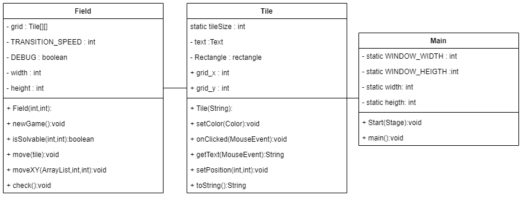

# Fifteen Puzzle

This repository is a final project (Java GUI) from Object-Oriented Programming Class, Teknik Informatika Universitas Padjadjaran. 

[Challenge Guidelines](challenge-guideline.md)

**Puzzle yang terdiri dari kotak sebanyak n\*n-1 (memiliki angka) yang terbentuk secara acak, dimana cara penyelesaiannya adalah dengan mengurutkan puzzle sesuai urutannya**

## Credits
| NPM           | Name        |
| ------------- |-------------|
| 140810200020  | Andaru Danurdara Wibisana    |
| 140810200032  | Irfan Kamal    |
| 140810200048  | Muhammad Attila An Naufal |

## Change log
- **[Sprint Planning](changelog/sprint-planning.md) - (17/11/2021)** 
   - Berusaha mencari informasi dan referensi mengenai Gradle dan JavaFX

- **[Sprint 1](changelog/sprint-1.md) - (From 17/11/2021 to 23/11/2021)** 
   - Assign repo dan buat planning

- **[Sprint 2](changelog/sprint-2.md) - (From 24/11/2021 to 01/12/2021)** 
   - Membuat class puzzle dengan atributnya
   - Membuat method pembuatan papan puzzle
   
- **[Sprint 3](changelog/sprint-3.md) - (From 01/12/2021 to 08/12/2021)** 
   - Membuat UML yang sebelumnya direncanakan sudah jadi di minggu lalu
   - Membuat sistem new game, reset, serta shuffle yang juga sebelumnya direncanakan sudah selesai minggu lalu
   - Membuat listener mouse
   - Membuat method pengecek apakah puzzle solvable
   - Membuat method pengecek apakah puzzle solved
   - Membuat GUI

## Running The App

- Jalankan program aplikasi melalui terminal :
   - Puzzle 4 x 4 (default) : <code>.\gradlew run</code> 
   - Puzzle n x n (custom) : <code>.\gradlew run --args=n</code> 
- Muncul sebuah window dengan puzzle.
- Selesaikan puzzle dengan cara mengklik dan menggeser tile-tilenya sesuai dengan kolom kosong
- Puzzle selesai setelah semua angka terurut
- Player bisa mengulang lagi permainan dengan menekan tombol reset

## Classes Used

- **Main.java** : Class utama/main class dimana program dimulai
- **Field.java** : Class untuk papan puzzle dan algoritma program
- **Tile.java** : Class untuk struktur dari tile-tile puzzle

## Notable Assumption and Design App Details

- Tile puzzle yang sudah terurut akan berubah menjadi warna biru tua, sedangkan yang belum terurut warnanya tetap biru muda
- Window puzzle resizable, namun tetap gunakan size default untuk tampilan yang lebih baik
